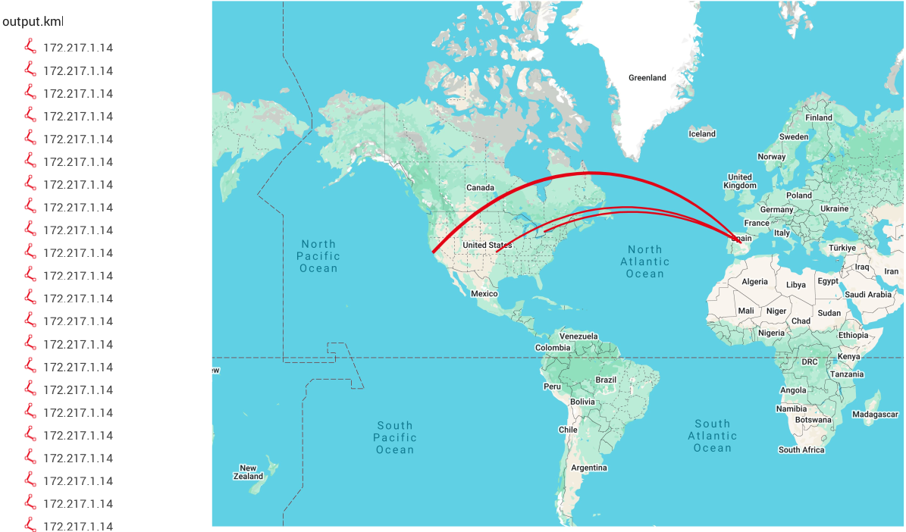

# Network Traffic Geolocation Visualizer

## Overview
This project visualizes network traffic geolocation by analyzing a Wireshark packet capture (PCAP) file, converting the data into a KML (Keyhole Markup Language) format using a custom Python script, and mapping the results on Google Maps. The script processes the PCAP file to extract IP addresses, maps them to geographical coordinates, and generates a KML file to plot network paths. The final output is a geographical map showing source and destination IP connections as lines across the globe, with an example visualization spanning from the United States to Spain over the North Atlantic Ocean.

## Features
- **Packet Analysis**: Extracts source and destination IP addresses from a Wireshark PCAP file using the `dpkt` library.
- **Geolocation Mapping**: Converts IP addresses to geographical coordinates (latitude and longitude) using the `pygeoip` library with the GeoLiteCity database.
- **KML Generation**: Creates a KML file with placemarks and lines representing network connections, styled for visualization.
- **Google Maps Integration**: The generated KML file is imported into Google Maps to display the network traffic paths on a world map.

## Technologies Used
- **Python Libraries**:
  - `dpkt`: For parsing PCAP files and extracting IP data.
  - `pygeoip`: For geolocating IP addresses using the GeoLiteCity database.
  - `socket`: For converting binary IP addresses to human-readable format.
- **Wireshark**: To capture network traffic and export it as a PCAP file.
- **Google Maps**: To visualize the KML output on a geographical map.

## How It Works
1. **Input**: A PCAP file (`wire.pcap`) containing network traffic data is read using `dpkt`.
2. **IP Extraction**: The Python script (`script.py`) extracts source and destination IP addresses from each packet using the `dpkt.ethernet.Ethernet` class.
3. **Geolocation**: The `pygeoip` library maps the IPs to their geographical coordinates (latitude and longitude) using the GeoLiteCity database.
4. **KML Creation**: The script generates a KML file by creating placemarks and lines between the source and destination coordinates, styled with a blue translucent line.
5. **Output**: The KML file (`output.kml`) is saved and can be imported into Google Maps for visualization.
6. **Visualization**: The final map (as shown below) displays the network paths, with lines connecting locations like the United States and Spain.

7. ## Results
The output KML file was successfully visualized on Google Maps, showing network connections as red lines across the globe. In the example visualization, multiple connections are mapped between the eastern United States and Spain, with a consistent distance of 172,271.14 km, indicating the approximate path length over the North Atlantic Ocean.

### Visualization
Below is a screenshot of the network traffic paths visualized on Google Maps:



## Python Script
The script (`script.py`) is structured into three main functions:
- `retKML(dstip, srcip)`: Retrieves geographical coordinates for IPs and returns a KML placemark with a line connecting the two locations.
- `plotIPs(pcap)`: Iterates through the PCAP file, extracts IPs, and accumulates KML placemarks.
- `main()`: Orchestrates the process by reading the PCAP file, generating the KML content, and saving it to `output.kml`.

Here is the complete script:

```python
import dpkt
import socket
import pygeoip

gi = pygeoip.GeoIP('GeoLiteCity.dat')

def retKML(dstip, srcip):
    dst = gi.record_by_name(dstip)
    src = gi.record_by_name('x.xxx.xxx.xxx')  # <-- You might want to fix this later
    try:
        dstlongitude = dst['longitude']
        dstlatitude = dst['latitude']
        srclongitude = src['longitude']
        srclatitude = src['latitude']
        kml = (
            '<Placemark>\n'
            '<name>%s</name>\n'
            '<extrude>1</extrude>\n'
            '<tessellate>1</tessellate>\n'
            '<styleUrl>#transBluePoly</styleUrl>\n'
            '<LineString>\n'
            '<coordinates>%6f,%6f\n%6f,%6f</coordinates>\n'
            '</LineString>\n'
            '</Placemark>\n'
        ) % (dstip, dstlongitude, dstlatitude, srclongitude, srclatitude)
        return kml
    except:
        return ''

def plotIPs(pcap):
    kmlPts = ''
    for (ts, buf) in pcap:
        try:
            eth = dpkt.ethernet.Ethernet(buf)
            ip = eth.data
            src = socket.inet_ntoa(ip.src)
            dst = socket.inet_ntoa(ip.dst)
            KML = retKML(dst, src)
            kmlPts = kmlPts + KML
        except:
            pass
    return kmlPts

def main():
    f = open('wire.pcap', 'rb')
    pcap = dpkt.pcap.Reader(f)

    kmlheader = '<?xml version="1.0" encoding="UTF-8"?>\n<kml xmlns="http://www.opengis.net/kml/2.2">\n<Document>\n'\
                '<Style id="transBluePoly">' \
                '<LineStyle>' \
                '<width>1.5</width>' \
                '<color>501400E6</color>' \
                '</LineStyle>' \
                '</Style>'

    k
